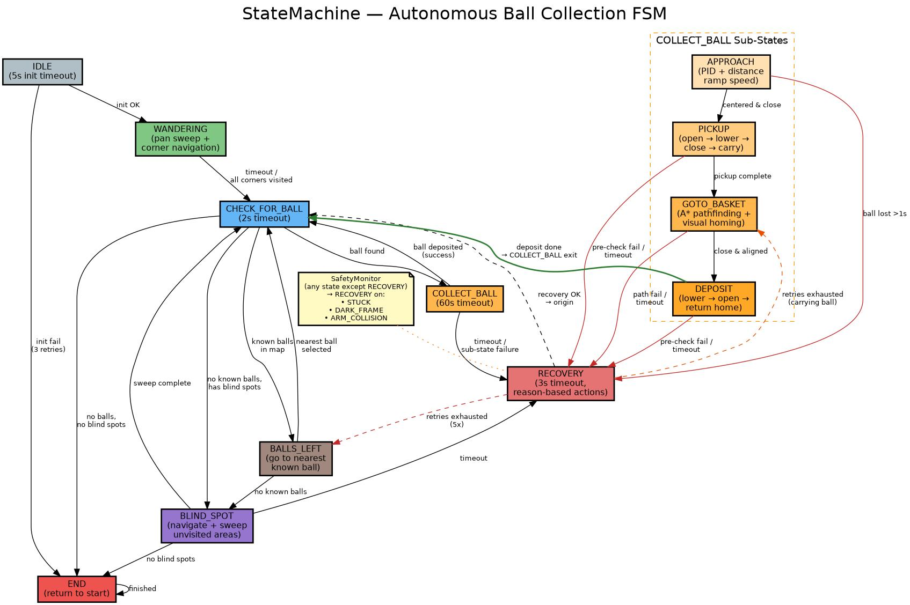

# 🤖 ITQ — Autonomous Bottle Cap Collector

[](https://hacklabs.beehiiv.com/)
[](.)
[](.)
[](https://github.com/waveshare/JETANK)

> **Mission:** Build an autonomous robot that navigates a parkour course, avoids obstacles, and collects as many bottle caps as possible — all within 5 minutes.
>
> **Hardware:** [Waveshare JETANK](https://github.com/waveshare/JETANK) — tracked robot with 4-DOF arm on NVIDIA Jetson Nano

---

## 🏆 Challenge

| | |
|---|---|
| **Track** | ITQ — Autonomous Detection and Collection of Bottle Caps with Computer Vision |
| **Prize** | 200€ cash |
| **Time Limit** | 5 minutes per run |
| **Scoring** | Caps collected (primary) + completion time + safety penalty |
| **Win Condition** | Most caps with **zero collisions** |

**Strategy:** Safe and steady beats fast and reckless. Every collision costs you.

---

## 🚀 Quick Start

All code runs on the **NVIDIA Jetson Nano** via **WiFi + Jupyter Notebook**.

### 1. Connect to the Jetson
```
# No SSH needed — Jupyter is already running on the robot
# 1. Connect laptop to WiFi: TP-LINK_744C (password: 15253354)
# 2. Open browser: http://192.168.0.100:8888/lab
# 3. Enter password: CIC@Tics1XAI
```

### 2. Open Jupyter Lab in Browser
```
# Jupyter is already running on the Jetson
# Open on your laptop browser:
http://192.168.0.100:8888/lab

# Password: CIC@Tics1XAI
```

### 3. Clone the Project (First Time Only)
In a Jupyter terminal (File → New → Terminal):
```bash
cd /workspace
git clone https://github.com/el-musleh/ITQ_HackLab_Team_2.git itq-bottle-cap-collector
cd itq-bottle-cap-collector
```

### 4. Run the Calibration Notebook
```
In Jupyter:
1. Navigate to itq-bottle-cap-collector/notebooks/
2. Open 00_calibrate_basket.ipynb
3. Run cells top-to-bottom (Shift+Enter)
```

---

## 🔄 Daily Jupyter Workflow

This is how the team works during the hackathon:

### Step 1: Power On & Connect
```
# 1. Turn on JETANK (battery switch)
# 2. Wait 60 seconds for Jetson to boot
# 3. Connect laptop to WiFi: TP-LINK_744C
# 4. Open Jupyter: http://192.168.0.100:8888/lab
# 5. Password: CIC@Tics1XAI
```

### Step 2: Open Browser & Navigate
- Open `http://192.168.0.100:8888/lab` on laptop
- Enter password: `CIC@Tics1XAI`
- Navigate to the project folder

### Step 3: Work in Notebooks
Each module has its own notebook:

| Notebook | Purpose | Who |
|----------|---------|-----|
| `00_calibrate_basket.ipynb` | Camera color/light calibration | Yashveer |
| `02_test_camera.ipynb` | Verify CSI camera capture | Yashveer |
| `03_test_servos.ipynb` | Test arm + chassis servos | Mohammad |
| `04_test_sensors.ipynb` | Read ultrasonic / IR distances | Myron |
| `05_detection_demo.ipynb` | Live cap detection overlay | Yashveer |
| `06_full_run.ipynb` | End-to-end autonomous run | Team |

### Step 4: Test & Iterate
```python
# Typical cell pattern in every notebook
import cv2
from src.hardware.camera import JetsonCamera
from src.perception.detector import CapDetector

cam = JetsonCamera()
detector = CapDetector()

frame = cam.read()
detections = detector.find_caps(frame)

# Show result
cv2.imshow('debug', detector.draw_overlay(frame, detections))
```

### Step 5: Save & Commit
```bash
# In Jupyter Terminal (New → Terminal)
cd ~/itq-bottle-cap-collector
git add notebooks/03_test_servos.ipynb
git commit -m "test: servo angles for arm pickup motion"
git push
```

---

## 🐍 From Notebook to `.py` Module

When a notebook cell works, convert it to a module:

```bash
# Convert notebook to Python script
jupyter nbconvert --to script notebooks/05_detection_demo.ipynb
# Creates: notebooks/05_detection_demo.py

# Then move the function into the real module
mv notebooks/05_detection_demo.py src/perception/detector.py
```

Or manually: copy the working cell into the `.py` file in the right package folder.

---

## ⚡ Jupyter Tips for Jetson Nano

| Tip | Why |
|-----|-----|
| **Restart kernel often** | Jetson has limited RAM (4GB). Restart clears leaked memory from OpenCV frames. |
| **Close figure windows** | `cv2.destroyAllWindows()` before running the next cell. |
| **Use `%matplotlib inline`** | Prevents extra GUI windows that crash headless Jetson. |
| **Limit camera resolution** | `cam.set_resolution(320, 240)` — smaller frames = faster detection + less RAM. |
| **One notebook at a time** | Running multiple notebooks eats RAM. Close finished tabs. |
| **Save before every run** | Jetson can freeze under load. `Ctrl+S` is your friend. |

---

## 📁 Project Structure

```
.
├── README.md                    # This file
├── setup.sh                     # One-command setup for all team members
├── run_tests.sh                 # Run pytest test suite (activates venv)
├── run_mujoco_sim.sh            # Launch MuJoCo simulation viewer (activates venv)
├── setup.cfg                    # Setuptools config (egg-info location)
├── requirements.txt             # Python runtime dependencies
├── requirements-dev.txt         # Dev/test dependencies (pytest, etc.)
├── config.yaml                  # Camera thresholds, PID gains, course params
├── pytest.ini                   # Test configuration
│
├── src/                         # 🐍 All Python source code
│   ├── main.py                  # Entry point — state machine orchestrator
│   │
│   ├── perception/              # 🎥 Computer vision module
│   │   ├── __init__.py
│   │   ├── camera.py            # Camera capture & calibration
│   │   ├── detector.py          # Bottle cap detection (HSV blob + YOLO fallback)
│   │   ├── obstacle_detector.py # Obstacle / wall detection
│   │   └── calibrate.py         # On-site color/light calibration tool
│   │
│   ├── control/                 # 🎮 Movement & navigation module
│   │   ├── __init__.py
│   │   ├── state_machine.py     # IDLE → WANDERING → COLLECT → DEPOSIT → END
│   │   ├── world_map.py         # Ball registry, blind-spot grid, coverage tracking
│   │   ├── pid.py               # PID controller for approach
│   │   ├── navigator.py         # Waypoint & path management
│   │   ├── odometry.py          # Pose estimation + landmark correction
│   │   └── safety_monitor.py    # Proactive stuck / dark-frame / arm-collision detection
│   │
│   ├── hardware/                # 🔧 Robot interface (JETANK / Jetson Nano)
│   │   ├── __init__.py
│   │   ├── chassis.py           # Tracked motor control via SCSCtrl
│   │   ├── arm.py               # 4-DOF arm servo control
│   │   ├── camera.py            # CSI camera on Jetson Nano
│   │   └── sensors.py           # Ultrasonic / IR sensors
│   │
│   └── utils/                   # 🔧 Utilities
│       ├── __init__.py
│       ├── telemetry.py         # Logging: caps seen, collected, collisions, time
│       └── visualizer.py        # Debug overlay for camera feed
│
├── notebooks/                   # 📓 Jupyter notebooks
│   └── ...
│
├── tests/                       # ✅ Validation scripts
│   ├── test_state_machine.py
│   ├── test_safety_monitor.py
│   ├── test_sim_hardware.py
│   ├── test_simulation_core.py
│   ├── test_utils.py
│   ├── mocks.py
│   └── __init__.py
│
└── docs/                        # 📄 Documentation
    └── ...
```

---

## 🧠 Architecture

```
Camera Feed
     │
     ▼
┌─────────────┐     ┌─────────────┐     ┌─────────────┐
│  Perception │────▶│   Control   │────▶│  Hardware   │
│  (OpenCV)   │     │(State Mach) │     │  (Motors)   │
└─────────────┘     └─────────────┘     └─────────────┘
      │                    │                    │
      ▼                    ▼                    ▼
┌─────────────┐     ┌─────────────┐     ┌─────────────┐
│  Cap Det.   │     │   PID Nav   │     │  Collector │
│  Obstacle   │     │  Recovery   │     │  Sensors   │
└─────────────┘     └─────────────┘     └─────────────┘
```

---

## 🧠 State Machine

The robot's brain is a single reusable state machine in `src/control/state_machine.py` that runs on both the real robot and the simulator.



Main flow:
`IDLE → WANDERING → CHECK_FOR_BALL → COLLECT_BALL → CHECK_FOR_BALL → BALLS_LEFT → BLIND_SPOT → END`

- `IDLE` initializes sensors and aborts on hard failures.
- `WANDERING` sweeps the camera, registers balls into the world map (with color and world coordinates), and calibrates the basket.
- `CHECK_FOR_BALL` decides whether to collect a ball, check the map, or explore blind spots. Registers detected balls in the world map and links `world_id` for collection tracking.
- `COLLECT_BALL` tracks the ball, picks it up, returns to the basket, and deposits it. Marks the ball as collected in the world map via `world_id`.
- `BALLS_LEFT` picks the nearest known ball from the map (with color for visual re-identification).
- `BLIND_SPOT` visits candidate viewpoints (adaptive grid with finer cells near obstacles) to find hidden balls.
- `END` returns to the starting corner and stops.
- `RECOVERY` handles transient failures with reason-based behavior (stuck, dark frame, arm collision, timeout).

A proactive **SafetyMonitor** runs before every state handler, checking for motor stall (StuckDetector), vision blackout (DarkFrameDetector), and arm link collisions (ArmCollisionDetector). Issues trigger an immediate transition to RECOVERY with a tailored response.

See `docs/state-machine.md` for the full diagram and tuning parameters, and `docs/state_machine.jpg` for the visual overview.

---

## 🛠️ Setup

### Hardware: Waveshare JETANK
| Component | Spec |
|-----------|------|
| **Platform** | NVIDIA Jetson Nano Developer Kit |
| **Chassis** | Tracked, high-torque DC geared motors |
| **Arm** | 4-DOF servo-driven robot arm |
| **Camera** | CSI camera (Jetson onboard) |
| **Programming** | WiFi + Jupyter Notebook |
| **Servo Bus** | SCSCtrl protocol |

> [JETANK GitHub Repo](https://github.com/waveshare/JETANK) — official examples for servo control, color tracking, motion detection, and gamepad control.

### Prerequisites (on Jetson Nano)
- JetPack 4.x+ installed
- Python 3.6+ (comes with Jetson)
- WiFi connected
- Git

### One-Command Setup (All Team Members)
```bash
# 1. Clone the project
git clone https://github.com/el-musleh/ITQ_HackLab_Team_2.git
cd ITQ_HackLab_Team_2

# 2. Run the setup script (installs everything)
./setup.sh

# 3. Activate the virtual environment
source venv/bin/activate

# 4. Start working
jupyter notebook --ip=0.0.0.0 --port=8888
```

**What `setup.sh` does:**
1. Installs system dependencies (`python3-pip`, `git`, `libgl1`, etc.)
2. Creates a Python virtual environment (`venv/`)
3. Installs Python packages from `requirements.txt` + `requirements-dev.txt`
4. Installs the `SCSCtrl` servo library from local source
5. Creates the project directory structure
6. Verifies all installations

### Manual Dependencies (if setup.sh fails)
```bash
# Core (Jetson-optimized)
pip install -r requirements.txt
pip install -r requirements-dev.txt

# JETANK servo control
pip install -e .  # from project root, installs SCSCtrl

# Detection (optional — color blob may be enough)
pip install ultralytics
```

### Hardware Checklist
- [ ] Jetson Nano booted and WiFi connected
- [ ] JETANK chassis assembled and tracked motors test-driven
- [ ] 4-DOF arm servos responding to SCSCtrl commands
- [ ] CSI camera capturing frames in OpenCV
- [ ] Ultrasonic / IR sensors reading distances
- [ ] Bottle cap "collection" mapped to arm motion (grab + lift + drop)
- [ ] Battery pack charged (spare recommended)
- [ ] Laptop can reach Jetson at `http://192.168.0.100:8888/lab`

---

## ▶️ How to Run or Test

### Option 1: Run the Test Suite

The project includes a pytest suite covering the state machine, safety monitor, odometry, world map, simulation hardware, and more.

```bash
# Quick way (activates venv + runs tests)
./run_tests.sh

# Or manually:
source venv/bin/activate
python3 -m pytest tests/ -v
```

Run only simulation tests (headless, no GUI required):
```bash
python3 -m pytest tests/ -m simulation -v
```

### Option 2: Run the PyBullet Simulation

A full physics simulation with the robot, arena, balls, and obstacles. Requires a display for GUI mode.

```bash
source venv/bin/activate

# Full autonomous run with GUI visualization
python src/simulation/run_simulation.py

# Basic motion test (GUI)
python src/simulation/test_basic_motion.py

# Perception pipeline test (GUI)
python src/simulation/test_perception.py

# Headless simulation tests (no display needed — safe for CI)
python -m pytest tests/ -m simulation -v
```

> See [`src/simulation/README.md`](src/simulation/README.md) for full simulation docs.

### Option 3: Run the MuJoCo Simulation

A MuJoCo-based digital twin of the arena with interactive viewer controls.

```bash
# Quick way (activates venv + checks deps + launches viewer)
./run_mujoco_sim.sh

# Or manually:
source venv/bin/activate
cd src/simulation_mujoco/bottle-cap-sim
pip install -r requirements.txt   # first time only
python -m src.main
```

| Key / Mouse | Action |
|---|---|
| Left drag | Rotate camera |
| Right drag | Pan |
| Scroll | Zoom |
| `Space` | Pause / resume |
| `Esc` | Exit |

> Requires Python ≥ 3.9, MuJoCo ≥ 3.0, and a display (OpenGL). See [`src/simulation_mujoco/bottle-cap-sim/README.md`](src/simulation_mujoco/bottle-cap-sim/README.md) for details.

### Option 4: Run on the Robot (Jetson Nano + JETANK)

The CLI entry point runs the full autonomous state machine on real hardware:

```bash
source venv/bin/activate
python -m src.main
```

This requires:
- NVIDIA Jetson Nano with JetPack 4.x+
- JETANK chassis with servos and CSI camera connected
- `jetbot` Python package installed
- Serial port permissions (`/dev/ttyTHS1`)

Press `Ctrl+C` to stop. The robot will safely shut down chassis, arm, and camera on exit.

### Option 5: Run via Jupyter Notebooks

For interactive development and calibration on the Jetson, see the [Quick Start](#-quick-start) section above. Key notebooks:

| Notebook | Purpose |
|----------|---------|
| `00_calibrate_basket.ipynb` | Camera color/light calibration |
| `02_test_camera.ipynb` | Verify CSI camera capture |
| `05_detection_demo.ipynb` | Live cap detection overlay |
| `06_full_run.ipynb` | End-to-end autonomous run |

---

## 👥 Team & Responsibilities

| Name | Role | Module | Status |
|------|------|--------|--------|
| **Yashveer Sookun** | Vision Lead | `src/perception/` | 🔴 Not started |
| **Salawu Wareeth** | Pipeline / Logging | `src/utils/telemetry.py` | 🔴 Not started |
| **Mohammed Abubakr Khan** | Integration / QA | `tests/` | 🔴 Not started |
| **Joaquín Morillo Soto** | Hardware / Mechanics | `src/hardware/` | 🔴 Not started |
| **Mohammad El Musleh** | Control Lead | `src/control/` + Jetson setup | 🔴 Not started |
| **Myron Sydorov** | Navigation / Recovery | `src/control/recovery.py` | 🔴 Not started |

**Workflow:** Each person owns their module. Open a PR when ready. Pair-review before merging.

---

## ✅ TODO / Progress

### Phase 1: Perception (Hour 0–2)
- [ ] Camera calibration script (`src/perception/calibrate.py`)
- [ ] HSV-based bottle cap detector
- [ ] Multi-frame validation filter
- [ ] Obstacle detection (reuse cap pipeline or dedicated sensor)

### Phase 2: Control (Hour 2–4)
- [ ] State machine implementation (`src/control/state_machine.py`)
- [ ] PID controller for line following (`src/control/pid.py`)
- [ ] Recovery behavior (stuck detection + escape)
- [ ] Integrate perception → control bridge

### Phase 3: Integration (Hour 4–6)
- [ ] End-to-end test on practice course
- [ ] Telemetry logging (caps, time, collisions)
- [ ] Tune detection thresholds on real lighting
- [ ] Tune PID gains for smooth movement

### Phase 4: Polish (Hour 6–8)
- [ ] Manual override / joystick fallback
- [ ] Backup demo video recorded
- [ ] Final stress test (battery, lighting, WiFi)
- [ ] **Submit**

---

## 🎯 MVP Definition

Before building anything fancy, the robot must:

1. Drive forward without crashing
2. See a bottle cap with the camera
3. Stop near the cap
4. Trigger a collection action

**Rule:** Nothing else gets built until MVP works. Optimization is a luxury; functionality is the requirement.

---

## ⚠️ Risk Register

| Risk | P | I | Mitigation |
|------|---|---|------------|
| False cap detection | M | H | HSV primary + YOLO backup; multi-frame validation |
| Stuck in corner | M | H | Timeout recovery: reverse tracks + rotate 45° |
| Collision | L | **C** | Conservative speed in APPROACH; ultrasonic / IR stop-distance |
| Battery failure | L | H | Fresh battery per run; voltage telemetry |
| Bad lighting | M | M | On-site calibration; wide HSV thresholds |
| Hardware failure | L | H | Recorded demo video as fallback |

---

## 📚 Resources

- [JETANK GitHub](https://github.com/waveshare/JETANK) — servo control, color tracking, motion detection examples
- [JETANK Color Tracking Example](https://github.com/waveshare/JETANK/tree/master/JETANK_5_colorTracking) — highly relevant to cap detection
- [OpenCV Docs](https://docs.opencv.org)
- [YOLOv8 Quickstart](https://docs.ultralytics.com/quickstart/)
- [NVIDIA Jetson Nano Docs](https://developer.nvidia.com/embedded/jetson-nano-developer-kit)

---

## 📝 Git Workflow

```bash
# Start your module
git checkout -b feature/perception-detector

# Commit often
git add perception/detector.py
git commit -m "feat: add HSV bottle cap detector"

# Push and open PR
git push origin feature/perception-detector
# Tag Mohammad or Myron for review
```

---

*Event:* AI & Robotics Hackathon Berlin — Team 2 — ITQ Track  
*Last updated:* June 21, 2026 (Hackathon Day — Active Development)
