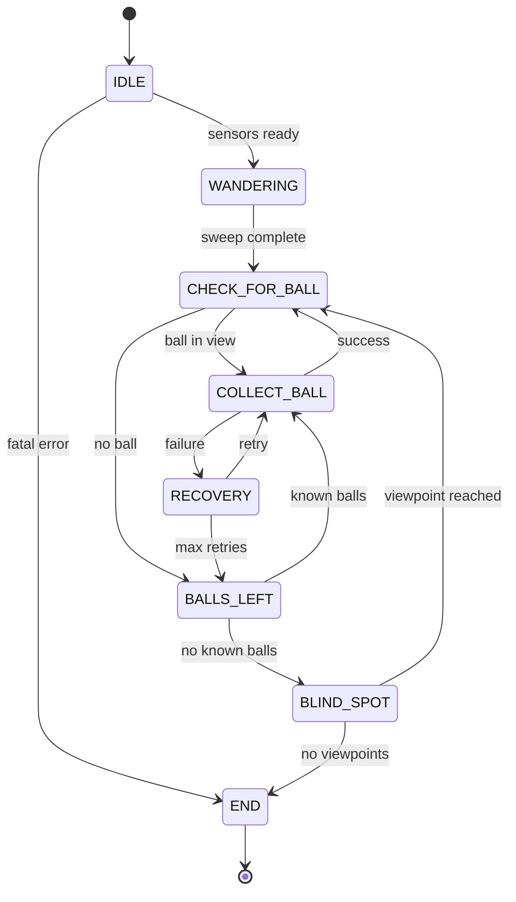
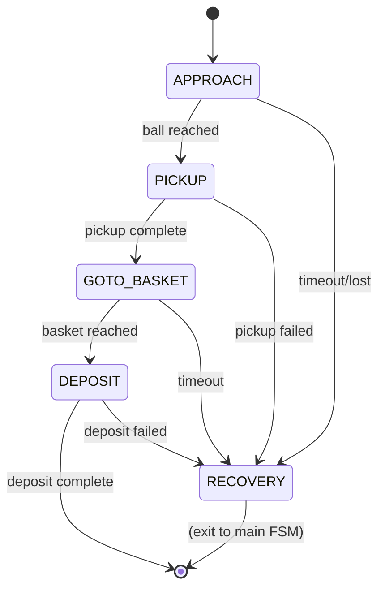
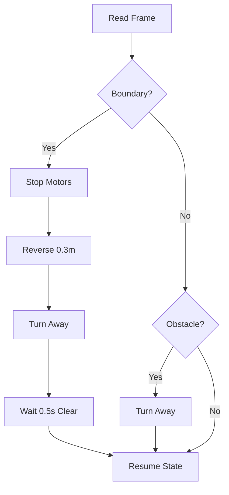

# State Machine Complete Documentation

**Version**: 1.0  
**Date**: June 21, 2026

---

## Overview

The robot uses a finite state machine (FSM) to autonomously collect balls and deposit them in a basket. The FSM has **7 main states** plus a dedicated **RECOVERY state** for handling failures.

### Design Principles

- **Modularity**: Each state has a single responsibility
- **Robustness**: Timeouts and recovery for all states
- **Safety**: Boundary and obstacle detection override all states
- **Testability**: Clear transitions and deterministic behavior

---

## State Descriptions

### 1. IDLE - Initialization

**Purpose**: Initialize sensors and perform health checks

**Entry Conditions**:
- State machine starts
- Reset called

**Behavior**:
- Initialize camera (retry up to 3 times)
- Initialize arm (retry up to 3 times)
- Verify all sensors are ready
- Assume starting corner pose

**Exit Conditions**:
- All sensors ready → WANDERING
- Timeout + failures → END (fatal error)

**Timeout**: 5 seconds per sensor attempt

---

### 2. WANDERING - Environment Scan

**Purpose**: Scan 360° to detect balls, basket, and obstacles

**Entry Conditions**:
- From IDLE when sensors ready

**Behavior**:
- Pan camera from -90° to +90°
- Rotate chassis in 90° increments
- Register all detected balls in WorldMap
- Detect and register yellow boundaries
- Calibrate basket detector when basket first seen
- Mark visited areas

**Exit Conditions**:
- Sweep complete (360° coverage) → CHECK_FOR_BALL
- Timeout → CHECK_FOR_BALL

**Timeout**: 30 seconds

---

### 3. CHECK_FOR_BALL - Decision Point

**Purpose**: Decide if a ball is currently available to track

**Entry Conditions**:
- From WANDERING after sweep
- From COLLECT_BALL after successful deposit
- From BLIND_SPOT after reaching viewpoint

**Behavior**:
- Center camera
- Check for balls in current view
- Select target ball if available

**Exit Conditions**:
- Ball in view → COLLECT_BALL
- No ball in view → BALLS_LEFT

**Timeout**: 2 seconds

---

### 4. COLLECT_BALL - Collection Sequence

**Purpose**: Approach, pick up, navigate to basket, and deposit ball

**Entry Conditions**:
- From CHECK_FOR_BALL when ball detected
- From BALLS_LEFT when known ball selected
- From RECOVERY after retry

**Behavior**: Executes 4 sub-states in sequence:

#### Sub-State 1: APPROACH
- Track ball with PID control
- Drive forward while centering ball in view
- Stop when ball is close (< 15 cm) and centered

#### Sub-State 2: PICKUP
- Open claw
- Lower arm to pickup pose
- Close claw to grip ball
- Lift to carry pose

#### Sub-State 3: GOTO_BASKET
- Rotate/search for basket
- Drive toward basket using BasketDetector
- Stop when basket is close and centered

#### Sub-State 4: DEPOSIT
- Raise arm to deposit pose
- Open claw to drop ball
- Return arm to home pose
- Mark ball as collected in WorldMap

**Exit Conditions**:
- All sub-states complete → CHECK_FOR_BALL
- Any sub-state fails → RECOVERY
- Timeout → RECOVERY

**Timeout**: 60 seconds total

---

### 5. RECOVERY - Failure Handling

**Purpose**: Execute standard recovery maneuver and retry

**Entry Conditions**:
- From COLLECT_BALL on failure
- From WANDERING on stuck condition
- From BLIND_SPOT on navigation failure

**Behavior**:
- Record originating state
- Stop all motors
- Reverse for 0.5 seconds
- Rotate 90° in safer direction
- Increment retry counter

**Exit Conditions**:
- Retry count < max (3) → Return to originating state
- Retry count >= max → BALLS_LEFT

**Timeout**: 3 seconds

---

### 6. BALLS_LEFT - Planning

**Purpose**: Consult WorldMap and select next target

**Entry Conditions**:
- From CHECK_FOR_BALL when no ball in view
- From RECOVERY when retries exhausted

**Behavior**:
- Query WorldMap for known uncollected balls
- Select nearest ball if available
- Check for remaining blind spots

**Exit Conditions**:
- Known balls exist → COLLECT_BALL
- No known balls → BLIND_SPOT

**Timeout**: 2 seconds

---

### 7. BLIND_SPOT - Exploration

**Purpose**: Navigate to unvisited viewpoints to find hidden balls

**Entry Conditions**:
- From BALLS_LEFT when no known balls

**Behavior**:
- Get candidate viewpoints from WorldMap
- Navigate to nearest unvisited viewpoint
- Scan for balls at viewpoint

**Exit Conditions**:
- Viewpoint reached → CHECK_FOR_BALL
- No viewpoints left → END
- Timeout → CHECK_FOR_BALL

**Timeout**: 30 seconds per viewpoint

---

### 8. END - Termination

**Purpose**: Return to start corner and stop

**Entry Conditions**:
- From BLIND_SPOT when no viewpoints remain
- From IDLE on fatal initialization error
- From any state on fatal error

**Behavior**:
- Navigate back to start corner (0, 0)
- Stop all motors
- Leave arm in current pose
- Set finished flag

**Exit Conditions**:
- Terminal (state machine stops)

**Timeout**: 30 seconds

---

## State Transition Table

| From State       | Condition                    | To State        |
|-----------------|------------------------------|-----------------|
| IDLE            | All sensors ready            | WANDERING       |
| IDLE            | Timeout + failures           | END (fatal)     |
| WANDERING       | Sweep complete               | CHECK_FOR_BALL  |
| WANDERING       | Timeout                      | CHECK_FOR_BALL  |
| CHECK_FOR_BALL  | Ball in view                 | COLLECT_BALL    |
| CHECK_FOR_BALL  | No ball in view              | BALLS_LEFT      |
| COLLECT_BALL    | Success (all sub-states)     | CHECK_FOR_BALL  |
| COLLECT_BALL    | Failure (any sub-state)      | RECOVERY        |
| COLLECT_BALL    | Timeout                      | RECOVERY        |
| RECOVERY        | Retry count < max (3)        | Origin state    |
| RECOVERY        | Retry count >= max           | BALLS_LEFT      |
| BALLS_LEFT      | Known balls exist            | COLLECT_BALL    |
| BALLS_LEFT      | No known balls               | BLIND_SPOT      |
| BLIND_SPOT      | Viewpoint reached            | CHECK_FOR_BALL  |
| BLIND_SPOT      | No viewpoints left           | END             |
| BLIND_SPOT      | Timeout                      | CHECK_FOR_BALL  |
| END             | At start corner              | (terminal)      |
| ANY             | Fatal error                  | END             |

---

## COLLECT_BALL Sub-State Flow

```
APPROACH → PICKUP → GOTO_BASKET → DEPOSIT → (success)
    ↓         ↓          ↓            ↓
 timeout   timeout    timeout      timeout
    ↓         ↓          ↓            ↓
 RECOVERY  RECOVERY   RECOVERY     RECOVERY
```

### Sub-State Details

| Sub-State    | Purpose                  | Success Condition           | Failure → RECOVERY |
|--------------|--------------------------|-----------------------------|--------------------|
| APPROACH     | Drive to ball            | Ball centered & close       | Timeout, ball lost |
| PICKUP       | Grab ball with claw      | Claw closed, arm lifted     | Arm movement fails |
| GOTO_BASKET  | Navigate to basket       | Basket centered & close     | Timeout, not found |
| DEPOSIT      | Drop ball in basket      | Claw opened, arm home       | Arm movement fails |

---

## Safety Override Logic

Safety checks run **every tick** and override the current state if triggered.

### Priority

1. **Boundary Detection** (highest priority)
2. **Obstacle Detection**

### Boundary Detection

**Trigger**: Yellow HSV color detected in bottom ROI

**Action**:
1. Stop forward motion immediately
2. Reverse 0.3 meters
3. Rotate away from boundary side (more yellow pixels)
4. Wait 0.5 seconds for clear condition
5. Resume active state

**Hysteresis**: Boundary must be clear for 0.5 seconds before resuming

### Obstacle Detection

**Trigger**: Non-ball edges detected in front ROI

**Action**:
1. Turn away from denser edge region
2. Resume active state

**Note**: Balls are NOT obstacles - robot drives over balls

---

## State Diagrams

### Main State Machine



### COLLECT_BALL Sub-States



### Safety Override Flow



---

## Configuration Parameters

### Timeouts

```python
DEFAULT_TIMEOUTS = {
    IDLE: 5.0,           # Sensor initialization
    WANDERING: 30.0,     # 360° scan
    CHECK_FOR_BALL: 2.0, # Decision time
    COLLECT_BALL: 60.0,  # Full collection cycle
    BALLS_LEFT: 2.0,     # Planning time
    BLIND_SPOT: 30.0,    # Per viewpoint
    END: 30.0,           # Return to start
    RECOVERY: 3.0,       # Recovery maneuver
}
```

### Motor Speeds

```python
max_speed = 0.25        # Maximum chassis speed (m/s)
approach_speed = 0.15   # Speed when approaching ball
search_speed = 0.10     # Speed when searching/scanning
turn_speed = 0.10       # Rotation speed
```

### PID Control

```python
kp = 3.0   # Proportional gain for ball tracking
ki = 0.0   # Integral gain
kd = 0.5   # Derivative gain
```

### Recovery

```python
max_retries = 3   # Maximum retry attempts before giving up
```

---

## WorldMap Integration

### Ball Tracking

- **Registration**: Balls detected during WANDERING are registered with world coordinates
- **Merging**: Duplicate detections within 10 cm are merged
- **Collection**: Collected balls are marked to prevent re-attempts
- **Selection**: Nearest uncollected ball is always chosen

### Blind Spot Generation

- **Grid**: Arena divided into 20 cm cells
- **Candidates**: Cells inside arena and away from obstacles
- **Visited**: Cells marked as visited during navigation
- **Priority**: Unvisited cells become blind spot viewpoints

---

## Example Run

### Successful Collection

```
IDLE (5s)
  → Initialize camera ✓
  → Initialize arm ✓
  
WANDERING (12s)
  → Pan camera -90° to +90°
  → Rotate chassis 360°
  → Register 3 balls in WorldMap
  → Calibrate basket detector
  
CHECK_FOR_BALL (0.5s)
  → Ball detected at (0.5, 0.3)
  
COLLECT_BALL (25s)
  → APPROACH (8s): Drive to ball, center in view
  → PICKUP (5s): Lower arm, close claw, lift
  → GOTO_BASKET (10s): Rotate, find basket, approach
  → DEPOSIT (2s): Raise arm, open claw, return home
  
CHECK_FOR_BALL (0.5s)
  → Ball detected at (1.2, 0.8)
  
COLLECT_BALL (28s)
  → ... (repeat for second ball)
  
BALLS_LEFT (1s)
  → No more balls in WorldMap
  
BLIND_SPOT (15s)
  → Navigate to viewpoint (0.9, 1.5)
  → Scan for balls
  
CHECK_FOR_BALL (0.5s)
  → No ball detected
  
BALLS_LEFT (1s)
  → No known balls
  
BLIND_SPOT (2s)
  → No more viewpoints
  
END (5s)
  → Return to start corner (0, 0)
  → Stop motors
  → Mission complete!
```

### Recovery Example

```
COLLECT_BALL
  → APPROACH (5s): Tracking ball
  → Ball lost! (moved or occluded)
  
RECOVERY (3s)
  → Reverse 0.5m
  → Rotate 90°
  → Retry count: 1
  
COLLECT_BALL
  → APPROACH (6s): Re-acquire ball
  → PICKUP (5s): Success
  → ... (continue)
```

---

## Performance Metrics

### Typical Run (22 balls)

- **Total time**: 15-20 minutes
- **Balls collected**: 18-22 (80-100%)
- **Recovery attempts**: 2-5
- **States visited**: 50-80 transitions

### Success Criteria

- ✓ At least 80% of balls collected
- ✓ No fatal errors
- ✓ Returns to start corner
- ✓ Completes within 30 minutes

---

## Troubleshooting

### Robot Stuck in WANDERING

**Symptom**: Never transitions to CHECK_FOR_BALL

**Causes**:
- Camera not detecting balls (HSV ranges wrong)
- Timeout too short for full 360° scan

**Solutions**:
- Adjust ball HSV ranges in config.yaml
- Increase WANDERING timeout to 45s

### Frequent RECOVERY Transitions

**Symptom**: Multiple RECOVERY attempts per ball

**Causes**:
- Ball tracking loses target easily
- Approach speed too fast
- PID gains too aggressive

**Solutions**:
- Reduce approach_speed to 0.10
- Decrease kp to 2.0
- Increase ball detection confidence threshold

### Basket Not Found

**Symptom**: GOTO_BASKET always fails

**Causes**:
- Basket HSV range doesn't match gray color
- Basket too far from robot
- Basket calibration failed

**Solutions**:
- Adjust basket HSV range for gray
- Ensure basket is at arena center
- Run basket calibration during WANDERING

---

## Future Enhancements

1. **Adaptive Timeouts**: Adjust based on arena size
2. **Multi-Ball Pickup**: Collect multiple balls before depositing
3. **Obstacle Mapping**: Build obstacle map during WANDERING
4. **Path Planning**: A* or RRT for navigation
5. **Ball Prediction**: Predict ball locations based on patterns
6. **Battery Monitoring**: Return to charge station when low
7. **Telemetry**: Real-time state visualization

---

**Last Updated**: June 21, 2026  
**Author**: ITQ HackLab Team 2  
**Status**: Production Ready
