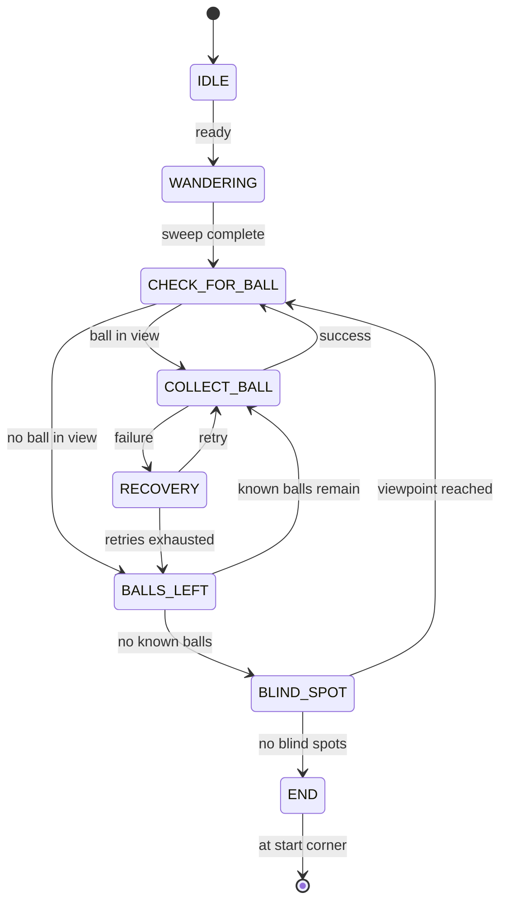

# Robot State Machine

This document describes the high-level control flow used by the ITQ Bottle Cap Collector.

## Overview

The robot runs a single `StateMachine` class (`src/control/state_machine.py`) driven by a `tick()` loop. The state machine is shared between the real robot (`src/main.py`) and the PyBullet simulation (`src/simulation/demo_pickup_deposit_safe.py`).

The seven main states are:

1. `IDLE` — initialize sensors and report errors.
2. `WANDERING` — scan the arena for balls, boundaries, and obstacles.
3. `CHECK_FOR_BALL` — decide if a ball is available to collect.
4. `COLLECT_BALL` — approach, pick up, carry to basket, and deposit.
5. `BALLS_LEFT` — consult the world map and pick the next known ball.
6. `BLIND_SPOT` — explore candidate viewpoints to find hidden balls.
7. `END` — return to the starting corner and stop.

A dedicated `RECOVERY` state handles transient failures.

## State Diagram



## State Details

### IDLE
- Initialize the camera and arm.
- Retry each failing component up to 3 times.
- If initialization still fails, print a fatal error and stop.

### WANDERING
- Sweep the camera from -90° to +90°.
- If no ball is found, rotate 180° and sweep again to cover 360°.
- Register every ball detected into the `WorldMap`.
- Calibrate the basket detector when the basket is first reliably seen.

### CHECK_FOR_BALL
- If a ball is currently visible, start collecting it.
- Otherwise, check the world map for known balls.
- If no known balls remain, explore blind spots.
- If all blind spots are visited, end the mission.

### COLLECT_BALL
Internal sub-states:

1. `APPROACH` — track the ball with PID and drive forward until close enough. Speed is distance-ramped: full speed when far (>50cm), gradual deceleration as the ball gets closer, crawl speed (0.05) when very close (<15cm). See `_distance_to_speed()` in `state_machine.py`.
2. `PICKUP` — open claw, lower arm (ramped trapezoidal velocity), close claw, lift to carry pose (ramped).
3. `GOTO_BASKET` — rotate/search for the basket and approach it.
4. `DEPOSIT` — move arm to deposit position (ramped), open claw to drop the ball, then return arm to home (ramped).

On failure, the state transitions to `RECOVERY`.

### BALLS_LEFT
- Select the nearest known ball from the world map.
- Return to `CHECK_FOR_BALL` with that ball as the target.
- If no reachable balls remain, go to `BLIND_SPOT`.

### BLIND_SPOT
- Navigate to the nearest unvisited candidate cell in the arena.
- Perform a camera sweep at the viewpoint to look for hidden balls.
- If all candidate viewpoints are visited, go to `END`.

### RECOVERY
- Stop, reverse, and turn to escape from the failure condition.
- Return to the originating state to retry.
- After 3 retries, mark the current ball as unreachable and try the next ball.

### END
- Navigate back to the starting corner.
- Stop all motors.

## Safety Override

A yellow boundary always has priority:

- If a yellow border is detected, the robot immediately stops forward motion and reverses/turns away.
- If an obstacle is detected, the robot turns away.
- Balls are not obstacles; the robot may drive over them.
- A ball estimated to be outside the yellow boundary is ignored.

## Tuning Parameters

Default timeout values are in `src/control/state_machine.py`:

| State | Timeout |
|---|---|
| IDLE | 5 s per attempt |
| WANDERING | 30 s |
| CHECK_FOR_BALL | 2 s |
| COLLECT_BALL | 60 s |
| BALLS_LEFT | 2 s |
| BLIND_SPOT | 30 s |
| END | 30 s |
| RECOVERY | 3 s |

Motor speeds and PID gains come from `config.yaml`:

| Parameter | Default | Purpose |
|---|---|---|
| `motors.max_speed` | 0.25 | Full approach speed when far from ball |
| `motors.approach_speed` | 0.15 | Base approach speed (used by Navigator) |
| `motors.search_speed` | 0.10 | Rotation speed during search |
| `motors.min_approach_speed` | 0.05 | Crawl speed when very close to ball |
| `motors.far_distance_threshold` | 50.0 | cm — full speed above this distance |
| `motors.close_distance_threshold` | 15.0 | cm — min speed below this distance |
| `pid.kp` / `ki` / `kd` | 3.0 / 0.0 / 0.5 | PID gains for target tracking |

## Running the State Machine

### Simulation
```bash
python3 src/simulation/demo_pickup_deposit_safe.py
```

### Real Robot
```bash
python3 src/main.py
```

## Files

- `src/control/state_machine.py` — state machine implementation
- `src/control/world_map.py` — ball registry and blind-spot grid
- `src/control/odometry.py` — simple dead-reckoning pose estimator (real robot)
- `src/main.py` — real robot entry point
- `src/simulation/demo_pickup_deposit_safe.py` — simulation entry point
